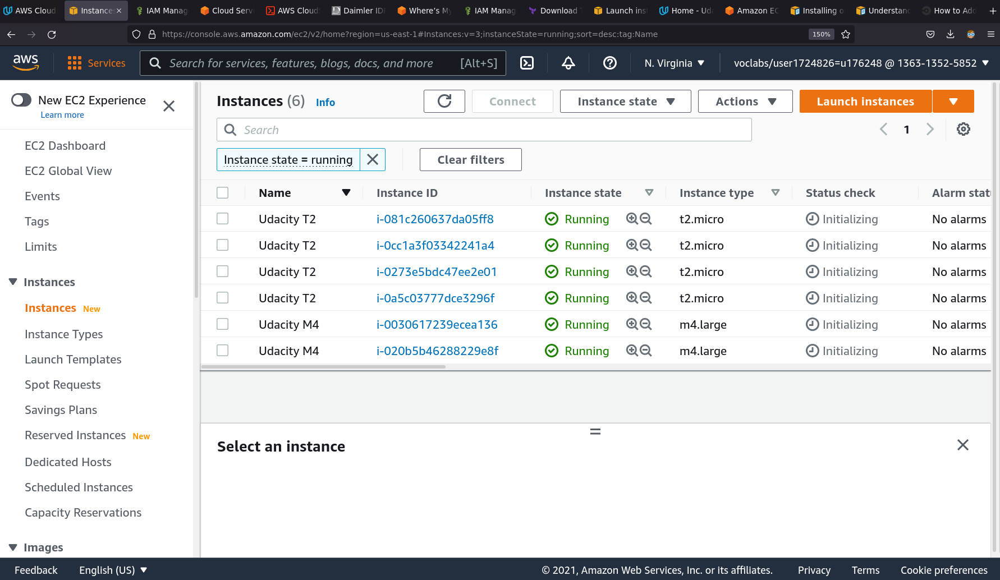
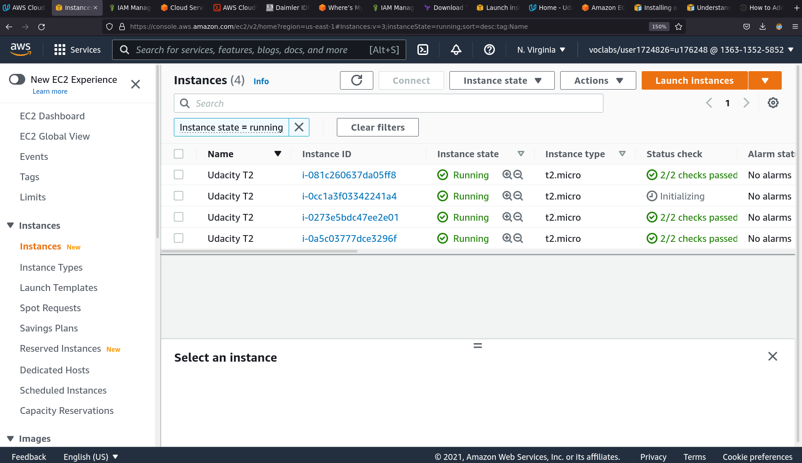
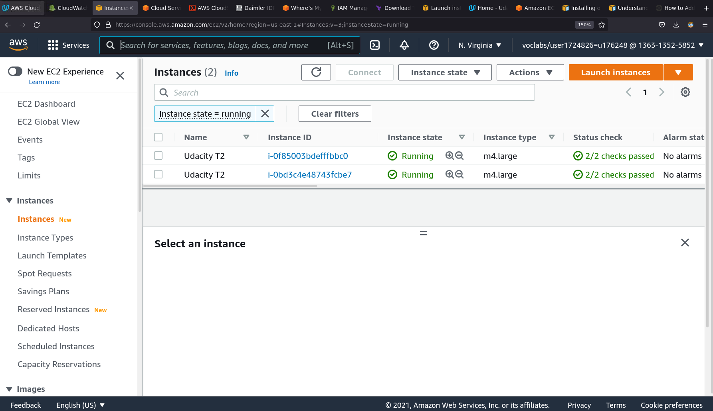
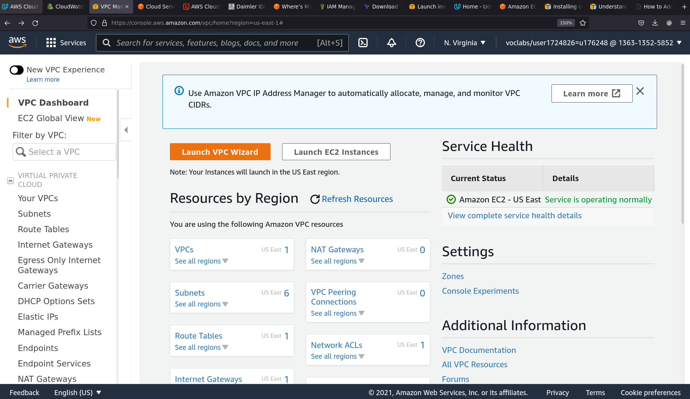
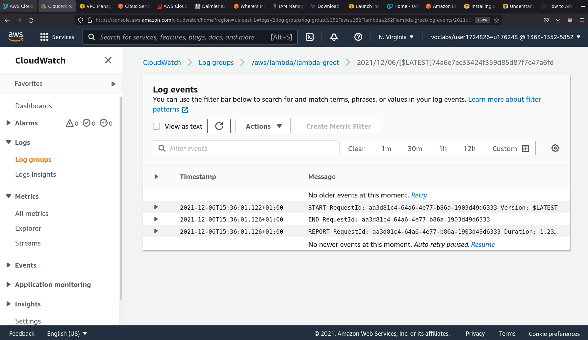
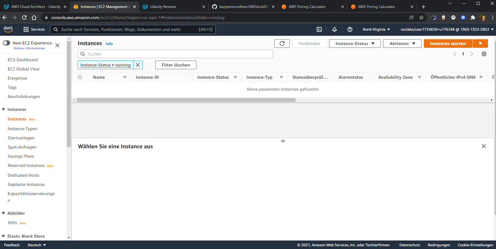

# Task 1: Create AWS Architecture Schematics

* For the IaaS implementation of the website see [Udacity_Diagram_1.pdf]
* For the FaaS implementation of the website see [Udacity_Diagram_2.pdf]

# Task 2: Calculate Infrastructure Costs

* For the initial cost estimates see [Initial_Cost_Estimates.csv](Initial_Cost_Estimates.csv) or [this estimate on AWS Pricing Calculator](https://calculator.aws/#/estimate?id=5530ec8743cfa6440b514cf0d186c5dcbb4f2bf1).
* For the reduced cost estimates see [Reduced_Cost_Estimate.csv](Reduced_Cost_Estimate.csv) or [this estimate on AWS Pricing Calculator](https://calculator.aws/#/estimate?id=12a9dce7f88f59b91c0260dfaca12e45340926c4)
  * Webserver instance type reduced from t3.2xlarge to t3.large (8 -> 2 CPU, 32 -> 8 GB RAM)
  * App Server instance type reduced from c5.12xlarge to c5.xlarge (48 -> 4 CPU, 96 -> 8 GB RAM)
  * Webserver and App Server IOPS both reduced from 1000 to 500
* For the increased cost estimates see [Increased_Cost Estimate.csv](Increased_Cost Estimate.csv) or [this estimate on AWS Pricing Calculator](https://calculator.aws/#/estimate?id=8130a9e4a84355f9644cd4f167bdbb9d6302fe48)
  * More web and app servers to reach more users (both: 2 -> 6)
  * Double the number of RDS databases (1 -> 2) in order to provision a read replica in another region
  * Double storage and throughput for RDS, S3 and CloudFront 

# Task 5: Use Terraform to Provision AWS Infrastructure

* Screenshots of EC2 list after `terraform apply` for the 6 EC2 instances & after removing the two `m4.large` instances with `terraform destroy -target=aws_instance.Udacity_M4`:

* Screenshots of the instances, VPC dashboard and CloudWatch logs of the lambda function created for Part 2 of the exercise:

